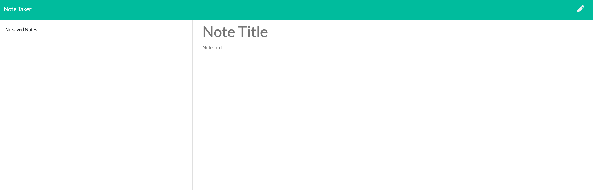

# Note Taker App
Demo (https://polar-beyond-92253.herokuapp.com/)

## Project Description 

The goal of this project is to create an application that can be used to write, save, and delete notes based on a user's input. For users that need to keep track of a lot of information, it's easy to forget or be unable to recall something important. Being able to take persistent notes allows users to have written information available when needed.





## Table of Content

  - [Project Description](#project-description)
  - [User Story](#user-story)
  - [Criteria](#criteria)
  - [Installation](#installation)
  - [Usage](#usage)
  - [Questions](#questions)
  - [License](#license)

## User Story

```md
AS A user, I want to be able to write and save notes

I WANT to be able to delete notes I've written before

SO THAT I can organize my thoughts and keep track of tasks I need to complete
```


## Criteria

```md
Application should allow users to create and save notes.

Application should allow users to view previously saved notes.

Application should allow users to delete previously saved notes.

```


## Installation

This application will use an express backend and save and retrieve note data from a JSON file.


## Usage

* GET `/notes` - Should return the `notes.html` file.
  
* GET `*` - Should return the `index.html` file
  
* The application should have a `db.json` file on the backend that will be used to store and retrieve notes using the `fs` module.
  
* GET `/api/notes` - Should read the `db.json` file and return all saved notes as JSON.
  
* POST `/api/notes` - Should receive a new note to save on the request body, add it to the `db.json` file, and then return the new note to the client.
  
* DELETE `/api/notes/:id` - Should receive a query parameter containing the id of a note to delete. 
  


## Questions

Do you have questions or are you interested in my application? Connect with me and we can chat more!

Github: <a href="https://github.com/IreneAsay" target="_blank">IreneAsay</a> 

Email Address: irene.hsu.asay@gmail.com

## License

© Irene Asay. All Rights Reserved. Under the [MIT/](./LICENSE.txt) license.
